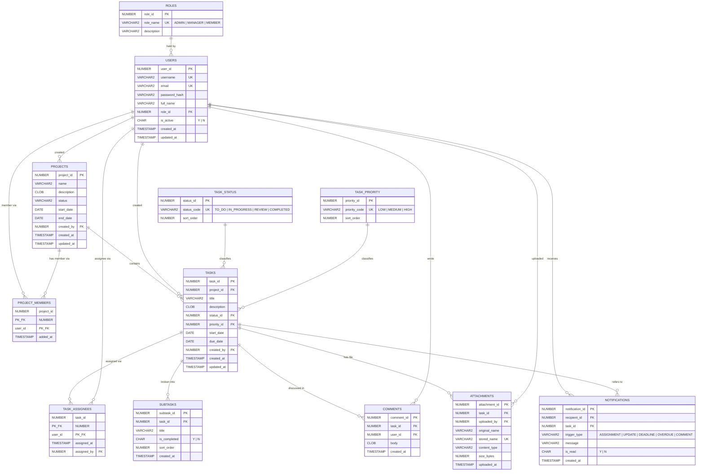

# Database Design — Entity Relationship Diagram

**Deliverable 11** · Task T013 · Source: [`database/erd/erd.mmd`](../database/erd/erd.mmd)

This diagram is generated from the authoritative data model in
[`specs/001-task-management-system/data-model.md`](../specs/001-task-management-system/data-model.md)
and matches the schema installed by [`database/ddl/run_all.sql`](../database/ddl/run_all.sql).

> **Rendering note**: the ERD is kept as Mermaid source rather than an exported image.
> GitHub renders Mermaid natively, so the diagram stays reviewable in pull requests and can
> never drift from a stale binary. Exporting a PNG would require adding `mermaid-cli`, a
> dependency no official requirement calls for (Constitution I and II).

## Diagram



## Entities

Twelve entities are modelled. `ACTIVITY_LOG` appears in the official list of *possible*
entities but is deliberately not modelled: no functional requirement reads from or writes to
it, so building it would add a write path no test could justify (Constitution I).

| Entity | Purpose |
|--------|---------|
| `ROLES` | The three roles: ADMIN, MANAGER, MEMBER. Reference data, seeded, immutable. |
| `USERS` | Identity, BCrypt password hash, profile, active flag, and exactly one role. |
| `PROJECTS` | Name, description, status, start and end dates, creator. |
| `PROJECT_MEMBERS` | Join table: users ↔ projects. Also defines task-sharing visibility. |
| `TASK_STATUS` | Reference data. Exactly four rows, in workflow order. |
| `TASK_PRIORITY` | Reference data. LOW, MEDIUM, HIGH. |
| `TASKS` | Title, description, status, priority, start and due dates, project, creator. |
| `TASK_ASSIGNEES` | Join table: tasks ↔ users. A task may have several assignees. |
| `SUBTASKS` | Breakdown of a parent task, with its own completion flag. |
| `COMMENTS` | Discussion on a task, with author and timestamp. |
| `ATTACHMENTS` | File metadata. Bytes live on the filesystem, not in the database. |
| `NOTIFICATIONS` | Recipient, trigger type, message, read flag. |

## Relationships

| Relationship | Cardinality |
|--------------|-------------|
| USERS → ROLES | Many users to one role |
| USERS ↔ PROJECTS via PROJECT_MEMBERS | **Many-to-many** |
| PROJECTS → TASKS | One project to many tasks |
| USERS ↔ TASKS via TASK_ASSIGNEES | **Many-to-many** |
| TASKS → TASK_STATUS | Many tasks to one status |
| TASKS → TASK_PRIORITY | Many tasks to one priority |
| TASKS → SUBTASKS / COMMENTS / ATTACHMENTS | One to many, each cascading on delete |
| USERS → NOTIFICATIONS | One user to many notifications |

Both many-to-many relationships use explicit join tables, as Constitution Principle IV
requires: a task must be assignable to one or more users, and a project must support multiple
members.

## Integrity guarantees enforced in the database

These are constraints, not application conventions — no route into the data, including direct
SQL, can violate them.

| Guarantee | Constraint | Requirement |
|-----------|------------|-------------|
| Exactly four task statuses | `ck_task_status_code` | FR-027, Constitution VI |
| Exactly three roles | `ck_roles_name` | FR-008 |
| Project end date not before start date | `ck_projects_dates` | US2 scenario 5 |
| Task due date not before start date | `ck_tasks_dates` | US3 scenario 5 |
| Unique username and email | `uq_users_username`, `uq_users_email` | FR-001 |
| A user joins a project at most once | `pk_project_members` | FR-014 |
| No duplicate task assignment | `pk_task_assignees` | FR-019 |
| Deleting a task removes its subtasks, comments, attachments, assignees | `ON DELETE CASCADE` | SC-011 |
| One scheduled notification per task/recipient/trigger | `uq_notifications_scheduled` | R-007 |
| Only the five official notification triggers | `ck_notifications_trigger` | FR-054–FR-058 |

## Verification

Run after installing the schema:

```sql
SELECT status_code FROM task_status ORDER BY sort_order;
-- Must return exactly: TO_DO, IN_PROGRESS, REVIEW, COMPLETED
```

The installed schema was verified on 2026-09-21: 12 tables, 9 planned indexes, 2 valid
packages, 0 invalid objects, and both guard tests (rejecting a fifth status and a fourth role)
passed.
