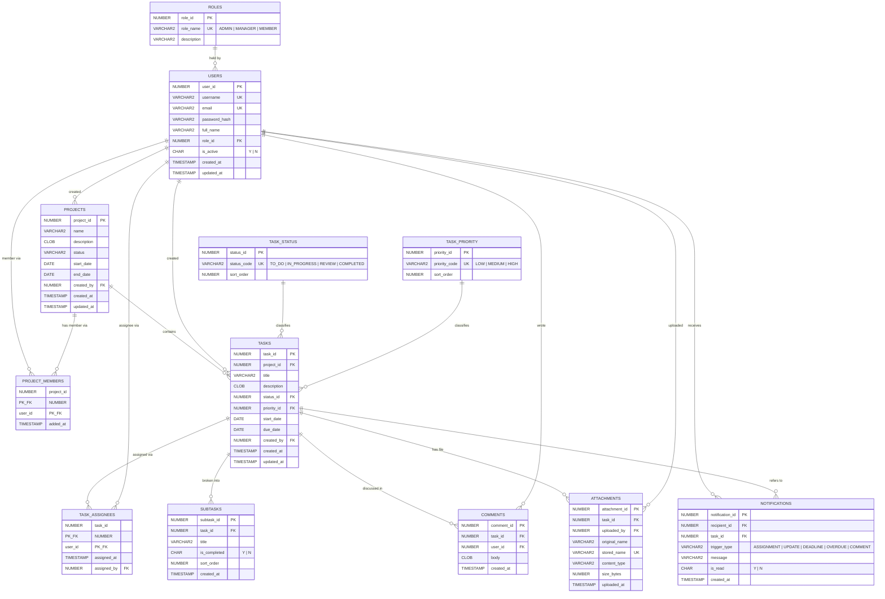

# Data Model & ERD: Task Management System

**Feature**: `001-task-management-system` | **Date**: 2026-09-21 | **Plan**: [plan.md](./plan.md)

This is the Database Design phase output (lifecycle step 3) and the source for required
deliverable 11 (Database design / ERD). Constitution Principle IV requires it to exist before
persistence code is written.

All twelve entities the official document lists as *possible* are modelled, except
ACTIVITY_LOG — see [Not modelled](#not-modelled) for why.

## Entity–Relationship Diagram



## Relationships

| Relationship | Cardinality | Source |
|--------------|-------------|--------|
| USERS → ROLES | Many users to one role | **[OFFICIAL]** roles and permissions; **[CLARIFIED]** the three roles |
| USERS ↔ PROJECTS via PROJECT_MEMBERS | Many-to-many | **[OFFICIAL]** assign project members |
| PROJECTS → TASKS | One project to many tasks | **[OFFICIAL]** tasks belong to projects |
| USERS ↔ TASKS via TASK_ASSIGNEES | Many-to-many | **[OFFICIAL]** assign tasks to one or more users |
| TASKS → TASK_STATUS | Many tasks to one status | **[OFFICIAL]** task status, fixed four-value workflow |
| TASKS → TASK_PRIORITY | Many tasks to one priority | **[OFFICIAL]** task priority |
| TASKS → SUBTASKS | One task to many subtasks | **[OFFICIAL]** subtasks |
| TASKS → COMMENTS | One task to many comments | **[OFFICIAL]** comments |
| TASKS → ATTACHMENTS | One task to many attachments | **[OFFICIAL]** attachments |
| USERS → NOTIFICATIONS | One user to many notifications | **[CLARIFIED]** notifications in scope |

The two many-to-many relationships are modelled with explicit join tables, as Constitution
Principle IV requires: a task must be assignable to several users, and a project must support
several members.

## Entity detail and validation rules

Validation rules trace to the functional requirement they enforce. Every rule listed here is
enforced **in the database** (constraint) **and** in the backend service layer, because
Constitution Principle IV requires validation at the trust boundary and the database is the
last line of defence.

### ROLES

Reference data, seeded, never edited at runtime. Exactly three rows: `ADMIN`, `MANAGER`,
`MEMBER` **[CLARIFIED, FR-008]**.

### USERS

| Rule | Source |
|------|--------|
| `username` and `email` unique, both required | FR-001 |
| `password_hash` required; plaintext never stored | FR-002, Constitution V |
| `role_id` required — every user holds exactly one role | FR-004 |
| `is_active` in ('Y','N'), default 'Y' | FR-006 |
| A user with `is_active = 'N'` is refused authentication and all actions | FR-007 |
| Users are never hard-deleted | spec Assumptions |

### PROJECTS

| Rule | Source |
|------|--------|
| `name` required | FR-009 |
| `status` required, constrained to a seeded value set | FR-012 |
| `end_date >= start_date` (check constraint) | US2 scenario 5 |
| `created_by` required, references USERS | FR-009 |

### PROJECT_MEMBERS

| Rule | Source |
|------|--------|
| Composite primary key (project_id, user_id) — a user joins a project at most once | FR-014 |
| Both foreign keys required | FR-014 |
| Membership determines project visibility **and** task sharing | FR-015, FR-035 **[CLARIFIED]** |
| Removing a membership row also removes that user's `TASK_ASSIGNEES` rows for tasks in that project | FR-014, FR-019, spec Edge Cases |

### TASK_STATUS

Reference data, seeded, immutable. Exactly four rows in workflow order: `TO_DO`,
`IN_PROGRESS`, `REVIEW`, `COMPLETED` **[OFFICIAL]**. A check constraint on `status_code`
prevents a fifth value from ever being inserted, satisfying Constitution Principle VI at the
storage layer — no route into the data, including direct SQL, can produce an invalid status.

### TASK_PRIORITY

Reference data, seeded, immutable. The official document requires task priority but does not
enumerate the values. **[PLAN]** `LOW`, `MEDIUM`, `HIGH` — a fixed ordered set, as the spec's
Assumptions require so that "tasks by priority" (FR-042) can be counted and filtered. Confirm
if a different set is wanted; adding a fourth value is a seed-data change only.

### TASKS

| Rule | Source |
|------|--------|
| `title` required | FR-016 |
| `project_id` required — a task always belongs to a project | FR-016 |
| `status_id` required, defaults to the `TO_DO` row on creation | US3 scenario 1 |
| `priority_id` required | FR-020 |
| `due_date >= start_date` (check constraint) | US3 scenario 5 |
| Deleting a task cascades to SUBTASKS, COMMENTS, ATTACHMENTS, TASK_ASSIGNEES, NOTIFICATIONS | US5 scenario 4, SC-011 |
| A task is *overdue* when `due_date < today` and status is not `COMPLETED` | FR-040 |
| A task is *pending* when status is not `COMPLETED` | spec Assumptions |

### TASK_ASSIGNEES

| Rule | Source |
|------|--------|
| Composite primary key (task_id, user_id) — no duplicate assignment | FR-019 |
| A task may have zero, one, or many assignee rows | FR-019 |
| `assigned_by` records who made the assignment, for permission auditing | FR-032 |
| Assignment permitted only where the acting user's role allows it | FR-032, FR-008b/c |

### SUBTASKS

| Rule | Source |
|------|--------|
| `task_id` required; a subtask belongs to exactly one parent task | FR-024 |
| `title` required; `is_completed` in ('Y','N'), default 'N' | FR-024 |
| Subtasks have no assignees, no dates, and no status workflow | FR-024 — the official document lists only "Subtasks"; anything more would be scope expansion |

### COMMENTS

| Rule | Source |
|------|--------|
| `task_id`, `user_id`, `body`, `created_at` all required | FR-026 |
| Displayed in `created_at` order with author | FR-026 |

### ATTACHMENTS

| Rule | Source |
|------|--------|
| `stored_name` unique and system-generated, never user-supplied | R-008 (path-traversal safety) |
| `original_name`, `content_type`, `size_bytes` recorded | FR-025 |
| Bytes live on the filesystem, not in the database | R-008 |
| No attachment row is written unless the file was stored successfully | spec Edge Cases |

### NOTIFICATIONS

**[CLARIFIED]** — this entity exists only because notifications were brought into scope.

| Rule | Source |
|------|--------|
| `recipient_id`, `trigger_type`, `created_at` required | FR-054–FR-058 |
| `trigger_type` constrained to the five official triggers | FR-054–FR-058 |
| `is_read` in ('Y','N'), default 'N' | FR-060 |
| Unique on (task_id, recipient_id, trigger_type) for `DEADLINE` and `OVERDUE` | R-007 — makes scheduled generation idempotent, so a task overdue for days notifies once |
| Never created for an inactive user; never references a task the recipient cannot see | FR-061 |

## State transitions

Task status is the only entity with a workflow **[OFFICIAL]**:

```text
To Do ──▶ In Progress ──▶ Review ──▶ Completed
```

The four states and this progression are fixed by the official document and Constitution
Principle VI. Per R-005, transitions between any two of the four states are permitted by
default (work does return from Review), and the progression above is the supported path
required by FR-028. Every transition passes through one service method and one endpoint,
`PATCH /tasks/{id}/status`.

Secondary state: `SUBTASKS.is_completed` toggles freely; `USERS.is_active` toggles between
active and deactivated **[OFFICIAL]**, reversibly.

**Subtask completion is independent of parent status.** A task MAY be moved to `COMPLETED`
while one or more of its subtasks remain incomplete; no warning is shown and the transition
is not blocked. *(Project decision — R-015. The official document defines no relationship
between subtask completion and parent task status, so none is invented.)*

## Indexes

Driven by the query patterns in FR-046 to FR-053 and the SC-006 performance target.

| Index | Column(s) | Serves |
|-------|-----------|--------|
| Primary keys | all PKs | — |
| `IX_TASKS_PROJECT` | TASKS(project_id) | FR-046 filter by project, project progress |
| `IX_TASKS_STATUS` | TASKS(status_id) | FR-048, FR-041 |
| `IX_TASKS_PRIORITY` | TASKS(priority_id) | FR-049, FR-042 |
| `IX_TASKS_DUE_DATE` | TASKS(due_date) | FR-050, overdue counts, deadline notifications |
| `IX_TASKS_TITLE_UPPER` | TASKS(UPPER(title)) — function-based | FR-051 case-insensitive title search |
| `IX_TASK_ASSIGNEES_USER` | TASK_ASSIGNEES(user_id) | FR-030, FR-043, FR-047 |
| `IX_PROJECT_MEMBERS_USER` | PROJECT_MEMBERS(user_id) | FR-015, FR-031 visibility predicate |
| `IX_NOTIFICATIONS_RECIPIENT` | NOTIFICATIONS(recipient_id, is_read) | FR-060 unread count |

## Not modelled

**ACTIVITY_LOG.** The official document lists it among *possible* entities, but no functional
requirement in the official document or in `spec.md` reads from or writes to it. Modelling it
would mean building a write path no requirement exercises and no test could justify, which
Constitution Principle I forbids. Adding it later is one table and one interceptor — a scope
decision for the project owner, not a design gap.

**Permissions as data.** FR-008a–c define what each of the three roles may do. Those rules are
fixed and small, so they live in code as Spring Security expressions rather than in a
PERMISSIONS table. A table would be required only if roles became user-definable, which no
requirement asks for.

## Implementation notes

- Primary keys use Oracle identity columns (`GENERATED BY DEFAULT AS IDENTITY`).
- Booleans are `CHAR(1)` constrained to `('Y','N')` — Oracle has no native boolean in SQL.
- All DDL is hand-written in `database/ddl/`, executed in dependency order, and is the single
  source of truth for the schema. No ORM is used: data access is `JdbcTemplate` with hand-written
  SQL and explicit `RowMapper`s, so nothing can generate, alter, or silently disagree with the
  schema (R-001).
- Each entity above maps to one repository class holding its SQL. The two join tables
  (PROJECT_MEMBERS, TASK_ASSIGNEES) are managed explicitly by the project and task repositories
  rather than by cascade configuration.
- Cascading deletes (task → subtasks, comments, attachments, assignees, notifications) are
  declared in the DDL as `ON DELETE CASCADE`, not in application code, so SC-011 holds for any
  route into the data.
- Timestamps are stored in the database server's local time; the spec's Assumptions record that
  no multi-timezone requirement applies.
- **No concurrency control.** There is no version column, no row-level optimistic locking, and
  no `updated_at` comparison on write. Concurrent updates are last-write-wins. *(Project
  decision — R-014. The official document does not address concurrent editing.)*
